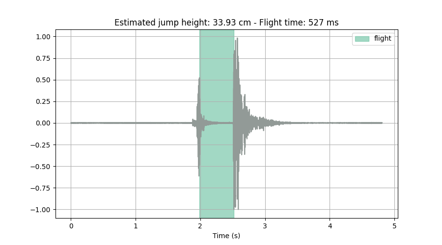

# Audio-Based Jump Height Estimation Algorithm

This repository hosts the Python implementation of the audio-based jump height estimation algorithm. This approach allows a simple and accessible way to measure vertical jump height using only audio data.



## Getting Started

### Prerequisites

Ensure you have Python installed on your machine. You can download Python [here](https://www.python.org/downloads/).

### Installation

1. Clone this repository.

```bash
git clone https://github.com/victormacedo10/jump_audio.git
```

2. Navigate into the cloned directory.

```bash
cd jump_audio
```

3. Install the required Python packages.

```bash
pip install -r requirements.txt
```

### Usage

To use the algorithm, you need to pass the file path of the jump audio file (.wav) as an argument to the run.py script. Here is an example:

```bash
python run.py path/to/your/file.wav
```

An example audio file (examples/jump_example.wav) is provided in this repository for you to test the code.

### Authors

- Victor Macedo

This work was done in the Laboratory of Research in Strength Training at the university of Brasilia (UnB), as the result of a Master's dissertation.

Any doubts or suggestions, contact us at:

lptfapps.unb@gmail.com